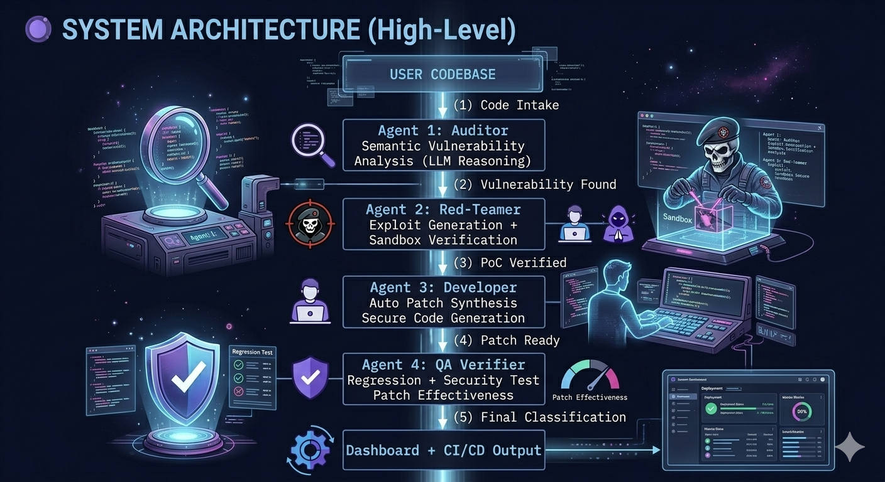
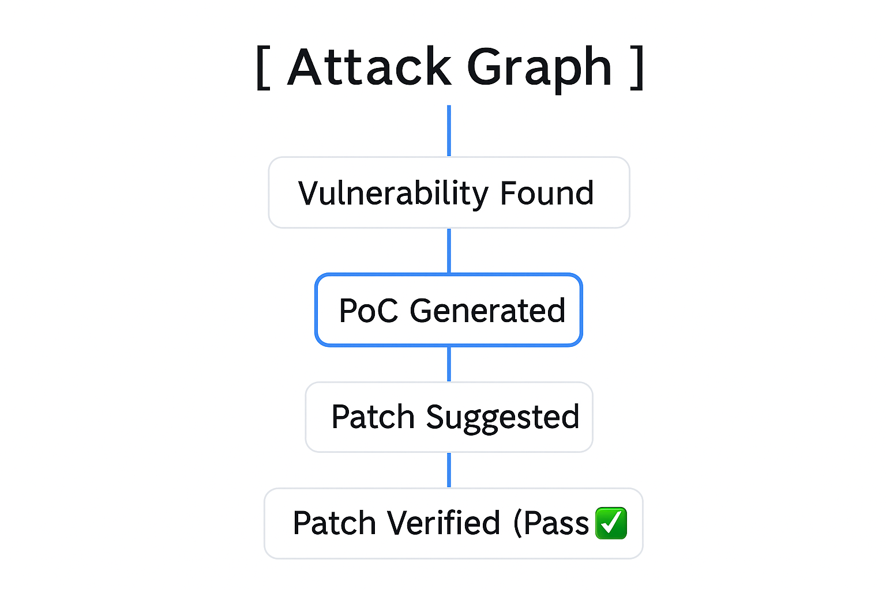

# Sentinel-Agent

## 🚀 Overview
Sentinel-Agent is a next‑generation autonomous cybersecurity ecosystem designed to detect, exploit, patch, and verify software vulnerabilities — completely without human intervention.

Unlike traditional tools (SAST/DAST) that rely on static pattern matching and often produce false positives, Sentinel-Agent uses LLM‑powered reasoning, dynamic verification, and closed‑loop self‑healing intelligence to deliver true AI‑driven cybersecurity.

---

## ✅ Core Capabilities
* 🔍 Deep Semantic Vulnerability Detection (LLM-based)
* 💥 Safe Automated Exploit Generation (AEG) with sandbox execution
* 🛠️ Intelligent Patch Synthesis following OWASP & industry standards
* ✅ Regression + Security Testing via autonomous QA verification
* 🔁 Cyclic State Machine enabling a continuous Detect → Exploit → Fix → Verify loop
* 📦 CI/CD Integration for DevSecOps pipelines

---

## 🧠 System Architecture (High-Level)

  

---

## 🔧 Tech Stack

| Layer | Technology |
| :--- | :--- |
| Core AI Reasoning | Llama 3, GPT‑4o |
| Orchestration | LangGraph (cyclic multi‑agent state machine) |
| Sandboxing | Docker, isolated execution containers |
| Knowledge Base | ChromaDB (CVE vector embeddings) |
| Cloud Infra | Google Cloud – Vertex AI |
| Frontend Dashboard | React / Next.js (Live Attack Graph) |

---

## ⚙️ Key Technical Innovations

1. Retrieval-Augmented Generation (RAG): Pulls real‑time CVE intelligence from global databases.
2. Automated Exploit Generation (AEG): AI‑created PoC exploits run in a secure Docker sandbox.
3. Chain‑of‑Thought Enhanced Patching: Improves reasoning transparency and patch correctness.
4. Fully Autonomous Cycle: No manual validation needed — system proves, fixes, and re‑tests automatically.

---

## 🎯 Project Deliverables
* ✅ Complete Multi‑Agent Framework
* ✅ Professional Security Dashboard (React/Next.js)
* ✅ Docker‑based exploit sandbox
* ✅ Fully autonomous Secure‑DevOps cycle
* ✅ Research documentation + performance metrics

---

## 📦 Installation

git clone https://github.com/mhusnain-tech/sentinel-agent.git 

cd sentinel-agent 

pip install -r requirements.txt

## 🔑 Setup Environment Variables

Before running the system, set the following environment variables:

- **LLAMA3_API_KEY** = your_llama3_api_key  
- **OPENAI_API_KEY** = your_openai_api_key  
- **GCP_PROJECT_ID** = your_gcp_project_id  
- **CHROMADB_PATH** = ./vectorstore
``

---
## ▶️ Running the System

### 1️⃣ Start the Multi‑Agent Engine
Run the backend engine:

python sentinel/engine.py

### 2️⃣ Run the Dashboard (Optional)
If you want to start the web dashboard:

cd dashboard  
npm install  
npm run dev

---

## 🔄 CI/CD Integration (Planned)

CI/CD integration using GitHub Actions is planned for future releases.
It will automatically run Sentinel-Agent on every push and pull request.

---

## 📊 Dashboard Preview
*(This is a conceptual workflow illustration. A real dashboard UI screenshot will be added once the frontend is implemented.)*

  

---

## 🤝 Contributing
We welcome security researchers, AI specialists, and DevOps engineers. Please create a pull request with clear descriptions and proper documentation.

## 📜 License
MIT License © 2026 — Sentinel-Agent Team

## 💬 Contact

👤 **Project Lead:** Muhammad Hussnain  
📧 **Email:** mhussnainiftikhar2003@gmail.com  
💼 **LinkedIn:** https://www.linkedin.com/in/mhusnain-ai  
📍 **Location:** Multan, Pakistan

